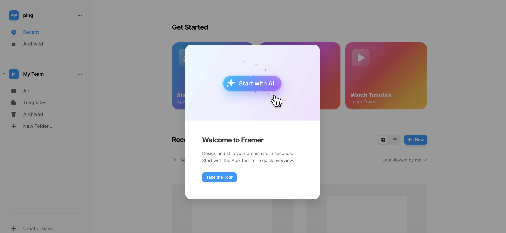

# AnyGPT:生产力提升平台

> 声明：此项目只发布于 GitHub，基于 MIT 协议，免费且作为开源学习使用。并且不会有任何形式的卖号和付费服务，谨防受骗。

> 积分体系说明：目前 API 和服务器都是出自 AnyChat，搭建积分体系是希望有用户能够在平台创作获取，帮助平台一起成长，支持免费申请用户积分，申请积分请联系管理员

> AnyGPT 欢迎大神指导

> 当前管理员
>
> - Charid-----VX:13721072141
>
> - <div style="display: flex; gap: 20px; width:200px">
>   	<div style="text-align: center">
>   		
>   	</div>
>   </div>

# 介绍

## 想法

整体的想法就是想利用 AI 生成一切

## 例子

- PPTGPT

------>用户选择生成 ppt，输入关键字[测试报告]

<-----生成测试相关的 PPT

- UIGPT

------>用户选择生成 UI，输入关键字[Wall—E]

<-----生成 Wall—E 相关的一个网页 UI

## 相关竞品

### framer

一个可以利用AI生成UI的网站

* website:https://framer.com/projects

  

### 其他竞品:待补充

## 待实现路线

[✓] 整体框架

[✓] 服务器、域名

[✓] 个人登录

[✓] AI对话

[✗] 错误包装

[✗] 页面的优化和适配

[✗] 代理请求

[✗] ai请求包含上下文

[✗] 积分体系

[✗] AI绘画

[✗] 性能优化

[✗] AI生成PDF

[✗] AI生成UI

[✗] 生成内容的持久化存储

[✗] 生成内容的分享

[✗] More...


# 参与共享

项目刚开始，个人前后端，整体不成熟，大神勿喷，欢迎指导

## 前端

### 项目

https://github.com/PigCharid/chatgpt

### 技术栈

`typescript` `javascript` `tailwindcss` `react`

### 本地请求|服务器请求设置

src/request/index.ts

```javascript
//本地请求
const API = axios.create({ baseURL: "http://localhost:8000" });
//服务器请求
const API = axios.create({ baseURL: "https://api.charid.xyz" });
```

> 注意：邮箱验证码是利用Gmail，AI模型用的chatgpt ，国内本地起后端服务的话验证码接口和chat接口请求可能会失败
>
> 其他配置：暂无其他配置

## 运行

* 安装

```
git clone git@github.com:PigCharid/chatgpt.git
```

* 安装依赖

```
npm install
```

* 运行

```
npm run start
```

* 打包

```
npm run build
```


## 后端

### 项目-隔壁仓库

> 暂时分两个仓库处理 

https://github.com/PigCharid/chatgpt_server

### 技术栈

`nodejs` `javascript` 

### 参数配置

> 如果有自己的配置信息，可以使用自己的，配置信息不能上传Github，没有的话联系管理员

```
cp .env.example ./.env
```

```
#openai API key设置
OPENAI_API_KEY=
#邮箱设置
EMAIL=
MEAIL_COD=
```

> 注意：邮箱验证码是利用Gmail，AI模型用的chatgpt ，国内本地起后端服务的话验证码接口和chat接口请求可能会失败，用亚太地区服务器可以

## 运行

* 安装

```
git@github.com:PigCharid/chatgpt_server.git
```

* 安装依赖

```
npm install
```

* 运行

```
npm run start
```

# 参与贡献

贡献之前请先阅读 [贡献指南](./CONTRIBUTING.md)

感谢所有做过贡献的人!

<a href="https://github.com/PigCharid/chatgpt/graphs/contributors">
  
</a>

# 赞助

如果你觉得这个项目对你有帮助，并且情况允许的话，可以给我一点点支持，总之非常感谢支持～

<div style="display: flex; gap: 20px;">
	<div style="text-align: center">
		
		<p>WeChat Pay</p>
	</div>
	<div style="text-align: center">
		
		<p>Alipay</p>
	</div>
</div>

# License

MIT © [Charid](./license)

